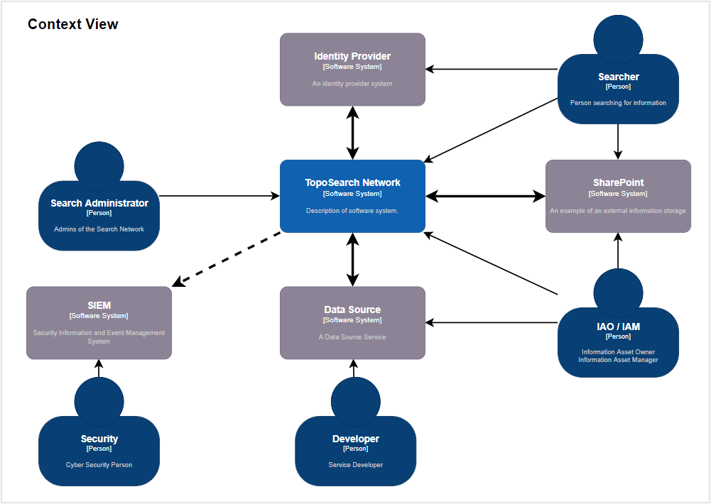
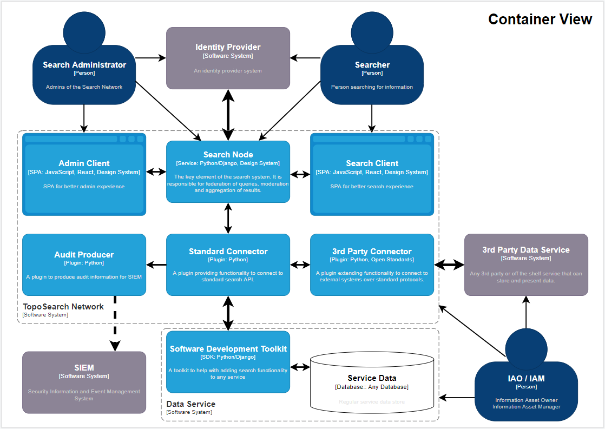
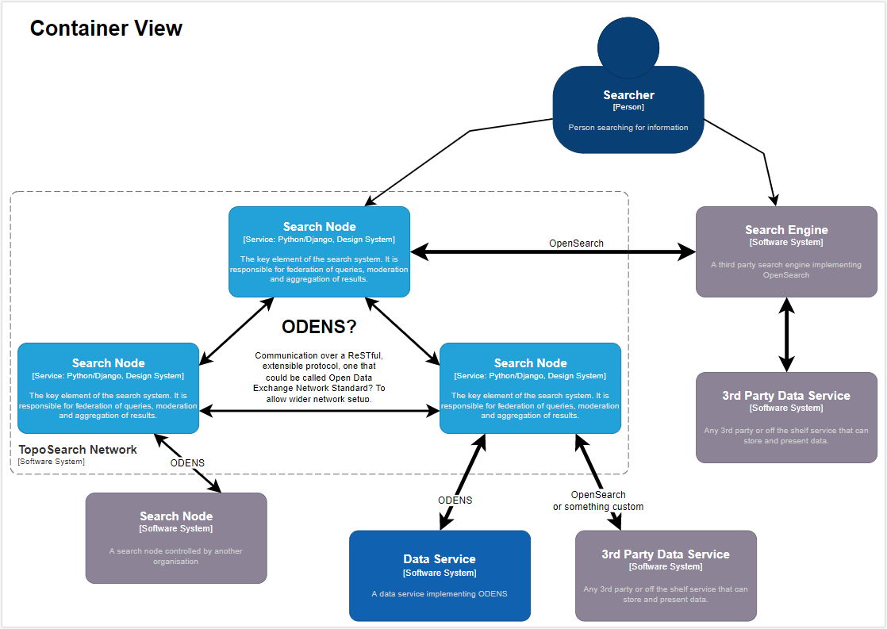

# Architecture

To document the design of the system I will use the [C4 modelling notation](https://c4model.com/).

## Context view

At the centre of the solution, there is **the search network**. It consists of several search service instances, typically deployed independently by the organisational units that want to provide search functionality to organisations or people they interact with. 

The search network interacts with four **types of system**:

* **Identity Providers** - the identity is essential in the search network and the source system. However, it is not the responsibility of the search network to act as an identity provider. 
* **Data Service** - any service developed by the organisation which can be closely integrated with the search infrastructure.
* **3rd Party Data Service** - any service storing data which we cannot modify to integrate closely with the search infrastructure.
* **Security Information and Event Management (SIEM)** - systems used in cyber security to look for threats.

There are five **types of users** interacting with the system:

* The **Searcher** - a person looking for information which is at the same time the person who understands the information and can offer feedback.
* The **Data Service Developer** - person who wants to make the information discoverable. 
* The **Search Administrator** - a person responsible for the operation of the search network.
* The **Information Asset Owner / Manager** - person responsible for the information stored in the source service and who is responsible for controlling the access to it. 
* The **Cyber Security Person** - person responsible for maintaining the solution's security. 

## Container view

In the container view, we can look closer at the elements of the TopoSearch Network. 

* **Search Node** - the service providing the API and the basic UI to build and operate the search network. It does the query federation, response moderation and aggregation. 
* **Standard Connector** - a plugin facilitating search services that implement the standard protocol. 
* **3rd Party Connector** - plugins facilitating search in services that do not implement the standard protocol. For example, search in SharePoint or in ElasticSearch.
* **Audit Producer** - a plugin that saves the data or delivers audit data for SEIM systems. 

### Software Development Kit (SDK)

The SDK is outside of the TopoSearch Network system. It is intended to be used by service developers to help with the rapid development of endpoint implementing the agreed search protocol. 

### Future improvements

While the Search Node provides all the necessary UI, reacher clients could be created for a better user experience. 

* **Admin Client** - an application for management of the search network.
* **Search Client** - an application for searching across the network.

## Protocols inside and outside of the network

