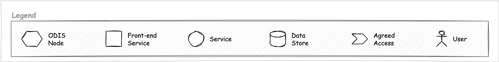

# A practical example

Distributed services require more effort to build, but are there any benefits? Let's look at an example of how a Customer Relationship Management (CRM) type of service could benefit from the distribution and application of hypermedia in service interactions design. 

## Setting the stage

To explain the benefits, let's look at an example with diagrams. Here are the main symbols I'm going to use. 

Imagine a CRM. A service used to handle information about businesses, people, events and locations. We want to extend its functionality by leveraging a few existing services (A, B, C) through the APIs they provide. The services may provide some information about some entities, offer simple operations, or even offer end-user services of their own. 

## Possible solutions

One way to do it is by building custom UI elements in the CRM specific to each of the services API. The CRM has to repeat this work for each service. The CRM becomes dependent on the APIs provided by the services it consumes. 

The solution appears reasonable and is very common. However, if the services provide their own UI, there might be some duplication of effort as now two teams must create UI for the same functionality. 

Micro UIs, also known as micro front-ends, is another possibility. The teams building individual services must now provide the API and a UI that communicates with that API. There is more effort on the service teams, but they could leverage the same micro UI in their services. The added benefit is that the service and the CRM can use the same UI to ensure user familiarity. 

The CRM team must provide a way to host the micro UIs. That is an added effort. There is also a risk of creating a two-way dependency. Because of that, this solution works best in closed organisations where technological techniques, patterns and practices are well established and controlled.

A significant downside is that the CRM team loses control over the UI they provide to their user, potentially leading to, paradoxically, a more fragmented user experience despite the close integration. 

Hypermedia in API offers yet another approach. In the *ODIS* project, I'm exploring the possibility of leveraging those concepts to solve the integration problems. 

Let's assume that ODIS is developed and working as intended. Then, the CRM can use the client package provided to extend its functionality, and implement changes to its UI, to be able to respond to some simple, standard ODIS data types. 

In addition to providing their UI and API, the services have to implement (using packages provided) the ODIS endpoints necessary for integration. 

All the services and the CRM now depends on a small, well-defined protocol of ODIS. This change of dependency direction might appear trivial and of little value, but I hope to show below that it changes a lot. 

*(There is a way to connect to services that already exist without the need to implement the ODIS endpoint directly, but that's outside of scope for this example).*

## The interactions

To show how the hypermedia approach differs from the other two architectures, let's examine the ODIS interaction mechanics. 

We assume that the ODIS network already exists and works with all the necessary standards defined. 

First, in their own time and when they are ready, the services register with that node providing a standardised description of entities they deal with, operations and services they provide. 

CRM service joins the network too, but without registering any services. Even though the CRM doesn't offer any services, this setup operation is necessary to configure the permissions. *(Strictly, this is not a requirement. It could provide services too, but for simplicity, let's assume it doesn't).*

Now, a user logs in to a CRM and searches for a business by name. Since ODIS provides search functionality, the CRM passes the query to ODIS in addition to searching in its data. The ODIS node federates the search to all registered services that support the search functionality. To make the search more specific, CRM can pass on information about the entity type the user is interested. Is it a business, an event or a location we are looking for? The services should honour that detail. 

Not all services will have information, but some might and those will return search results. The ODIS network handles the result aggregation deduplication and sends the aggregated result set to CRM. Finally, the information is presented to the user in UI fully controlled by the CRM team. 

*(This step is optional and makes sense only if the CRM is not only an aggregator of services, but contains its own data on the entities it manages).*

The user now decides to 'open' one of the results provided. The CRM provides the core of the information from its data. It also passes on the request for details/highlights/summary and any operations or services available to all the services in the network. 

The requested information is returned in a hypermedia format and rendered generic to the user. 

Thanks to hypermedia, it is now possible to invoke actions through CRM UI in the services that provided the data. But this might be useful only for simple actions, simple enough to be rendered in a standardised way from hypermedia alone. 

What is the service offered by one of the services is more complex and comes with its own complex user interaction? In that case, the interaction should be transferred to that service. 

## Potential benefits

So far, it might look like nothing but extra work. Why such indirection in using APIs? Especially that the resulting integration has to be simpler, less specific and might limit the type (and quality) of user experience we can offer. 

The benefits, especially over the micro UI approach, become more apparent when we look at what happens when we cross organisational boundaries where standardisation becomes a significant challenge. 

The ODIS network offers a standard way of extending the interactions described above across the organisational boundaries using a small and well-defined API. In addition, the hypermedia use in the API reduces the dependencies on specifics of any API design, even inside the ODIS network. 

The extension of the network and functionality will require some work around the security and set up of trust between the participating organisations. Still, it should be easier than agreeing on bulk data exchange and discussing data ownership. Each organisation remains the owner of data and in complete control of its services. They can decide whether to provide the service or disclose the data on each request. 

The added benefit is that each organisation is free to create its own user interfaces and CRMs. They can ensure that their users get the experience they need and expect. At the same time, without too much extra effort, they can expose existing functionality from other services to their users.

In this example, both users can access the functionality from services D, E and F, but each using their prefered application with a familiar UI. 

The most significant advantage of the hypermedia approach is how the network of services can be extended. Imagine the 'another organisation' developed a service G. It provides some functionality to do with businesses, locations, people or events so it is potentially of interest to the CRM users. As soon as the service G is registered in the ODIS network, that functionality can be surfaced in the CRM. The CRM user gets more out of the CRM while the Service G team gets more use out of their service improving the transaction cost and the in a federated world, better return on investment. 

*(In practice, probably there would have to be a step where the administrators of the CRM have to be notified of newly available service and choose to enable its use, but it becomes a runtime configuration rather than development effort).*

# Bringing it all together

While there might be some necessary reduction in detail of what is possible in CRM from the user experience point of view, we gain something else in the same regard. With minimal effort on the CRM team (or the user), the functionality of the CRM keeps growing.

## To make it work we will need:

* A working federation system, something like ODIS proposed in this repo. 
* We need to agree on a standard defining a set of well-understood entities. [Schema.org](https://schema.org) can be a solution to this. 
* It might be beneficial (if not necessary) to have a set of well defined and agreed upon standard actions. [Application Level Profile Semantics (ALPS)](http://alps.io/spec/) might be helpful here. 
* A rich enough hypermedia format to allow implementation of simple yet useful and dynamic UI in applications like the CRM, and a definition of a small standard big enough to present search results and some standardised highlights between services and the actions and operations. 

## This proposal is not without challenges

* There is an added complexity in the design and implementation. However, this needs to be done only once and then shared through documentation, training and software development kits. The bulk of the complexity would be concentrated in the ODIS node implementation. 
* To get the most exciting benefits, there would need to be some trust established between organisations. The solution would have to be secure enough to support that trust-building. 
* The exact set of the standard functionality still needs to be defined. As with any interaction design, there is a big challenge of finding the right balance between specificity that comes with easy of implementation, and flexibility that comes with complexity and cost. 

## But there are benefits to be had

* A way towards a single 'front door' for a group of entities optimised for each organisation, with access to services provided by a group of those organisations. 
* Ability to benefit from new services without extra development work. 
* Wider access to users for the development teams
* A better user experience