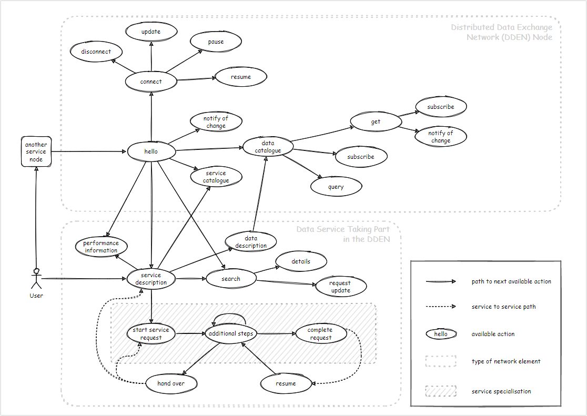

# Data Exchange Network

## Protocols inside and outside of the network

## Hypermedia interactions and their flow

The actions represent the affordances (what is possible). 
Naturally, there will be some data attached to it, but what really 
matters are affordances - the possible interactions. 

[Mike Amundsen - Twelve Patterns for Evolvable Web APIs](https://www.youtube.com/watch?v=qolWrn7hNro)

> It is easier to standardize representation and relation types than objects and object specific interfacts. (Roy Fielding)