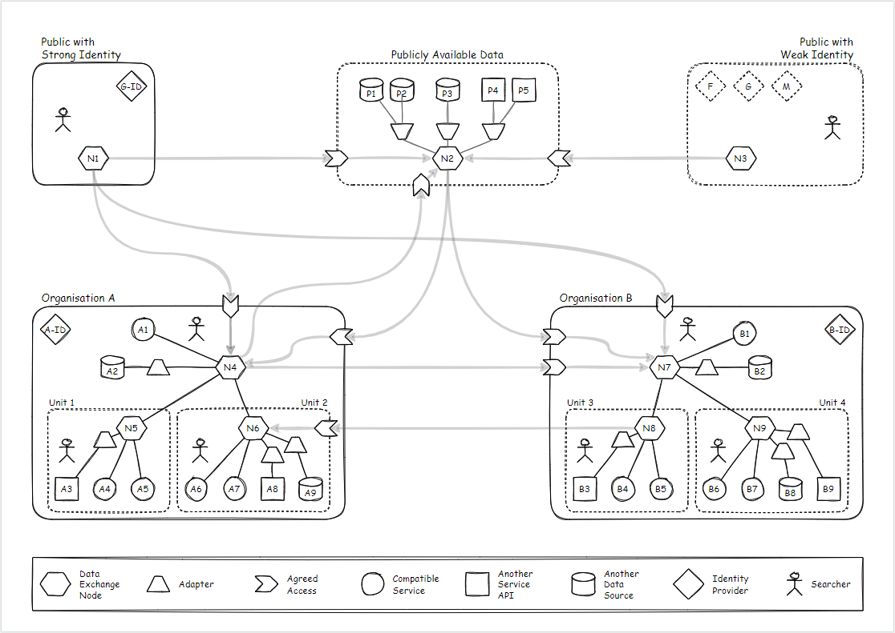
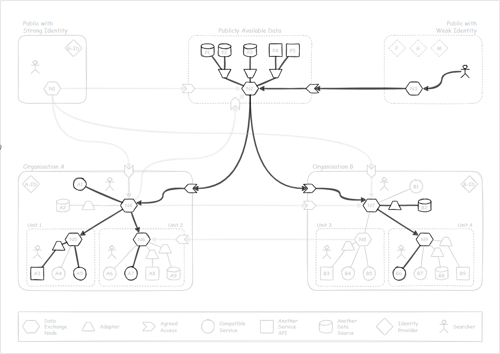
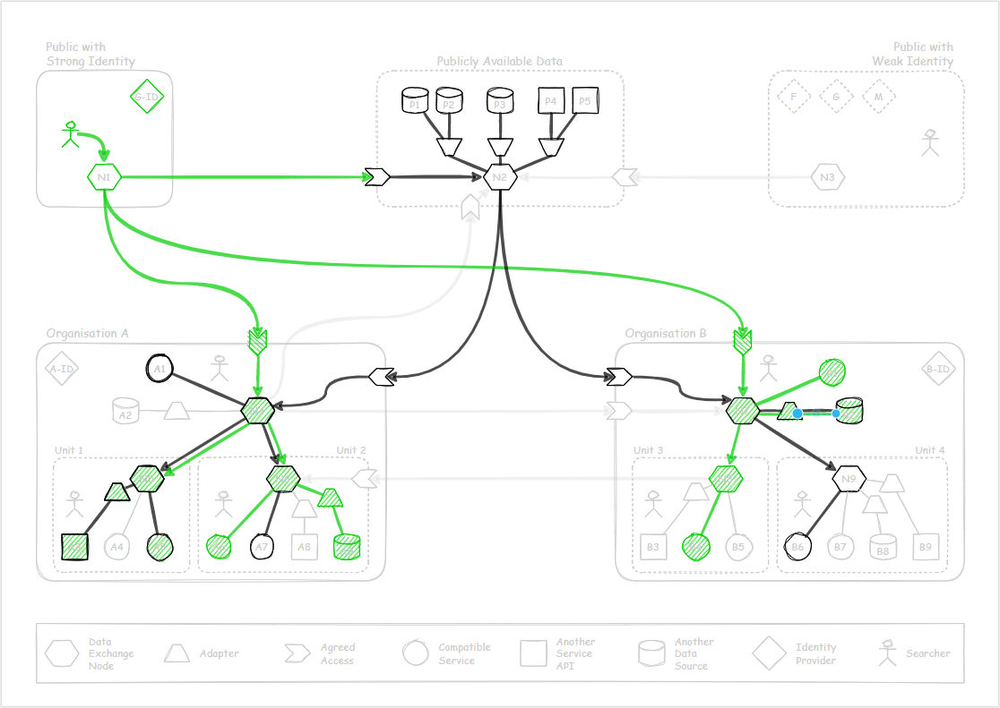
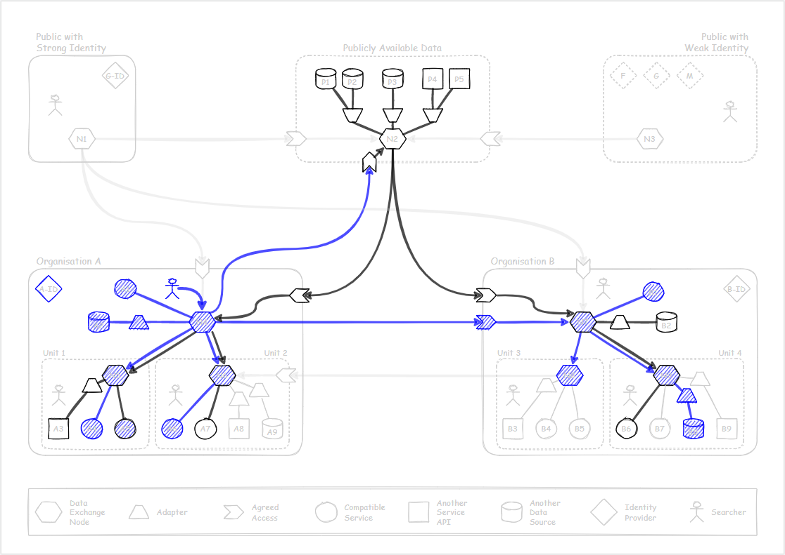
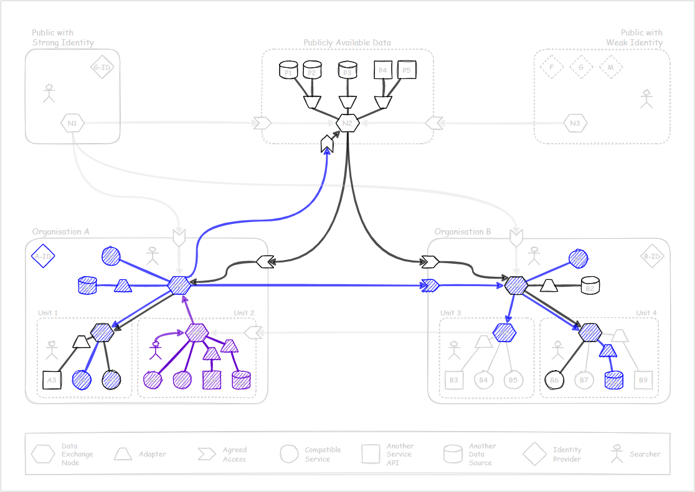

# Interactions

An example of interactions between integrated systems. 

&nbsp; 

## Unauthenticated flow

*Or a flow of a public user authenticated only with a weak identity*

A public user can discover and search any publically available data. 
Somme of that data may be stored centrally, while the others delivered directly
from the source services. 

Each organisation can decide which nodes in their control respond to public
requests for data, and which services support those requests. 

&nbsp;

## Authenticated public flow

*A flow for a user identified with a government issued digital identity.*

A person authenticated by a strong identity provider can access all 
the publically available data, but also request their information 
(their personal information, businesses they own and similar). 

Each organisation can choose which nodes in their control respond to 
authenticated public requests and which services support those requests. 

&nbsp; 

## Searching from Organisation A

The fact that the searcher is part of Organisation A doesn't mean automatically
they have access to all of the resources within the organisation. 
It is possible that some some organisational units restrict access
to data their are responsible for. 

Organisation B may make some of their resources available to anybody 
from Organisation A (B1, B8). But that shouldn't prevent searchers in Organisation A
to find results in Organisation B already available to the public (B2, B6).

&nbsp;

## Search from Unit 2

Searching from Unit 2 should result, in this example, in all data within the unit 
being available (but it could be more selective). The public search results, 
and those from Organisation B should not change. 