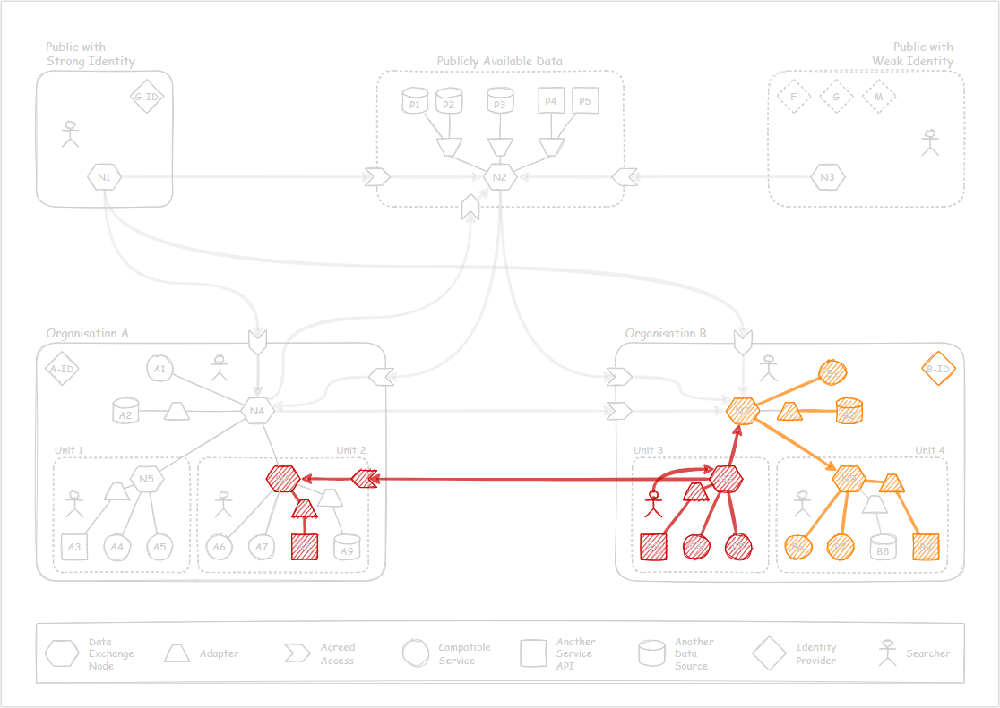

# Interactions

I find it difficult to descrbie the possibilities of using the search topology
as a context defining access, and perhaps scope of information available to searchers. 
With the map below I attempt to show possible interactions between different users
and components of the search network divided between multiple trust boundaries - 
organisations, units or types of authentication. 

The above map with all its elements might be confusing, but rather than explaining it
one element at a time, let's look at the specific information flows and, hopefully, 
the notation and its meaning will become apparent. 

&nbsp; 

## Unauthenticated flow

*Or a flow of a public user authenticated only with a weak identity*

A public user can discover and search any publically available data. 
Somme of that data may be stored centrally, while the others delivered directly
from the source services. 

Each organisation can decide which nodes in their control respond to public
requests for data, and which services support those requests. 

&nbsp;

## Authenticated public flow

*A flow for a user identified with a government issued digital identity.*

A person authenticated by a strong identity provider can access all 
the publically available data, but also request their information 
(their personal information, businesses they own and similar). 

Each organisation can choose which nodes in their control respond to 
authenticated public requests and which services support those requests. 

&nbsp; 

## Searching from Organisation A

The fact that the searcher is part of Organisation A doesn't mean automatically
they have access to all of the resources within the organisation. 
It is possible that some some organisational units restrict access
to data their are responsible for. 

Organisation B may make some of their resources available to anybody 
from Organisation A (B1, B8). But that shouldn't prevent searchers in Organisation A
to find results in Organisation B already available to the public (B2, B6).

&nbsp;

## Search from Unit 2

Searching from Unit 2 should result, in this example, in all data within the unit 
being available (but it could be more selective). The public search results, 
and those from Organisation B should not change. 

&nbsp;

## Search from Unit 3

Organisation B decided not to connect to the public data, but has a dedicated
connection to Unit 2 in Organisation A. This means that any searcher in Unit 3 
will be able to find information in A8 as well as most of services in Organisation B. 
However, users in Organisation B outside of Unit 3 will see only the Organisation B data.