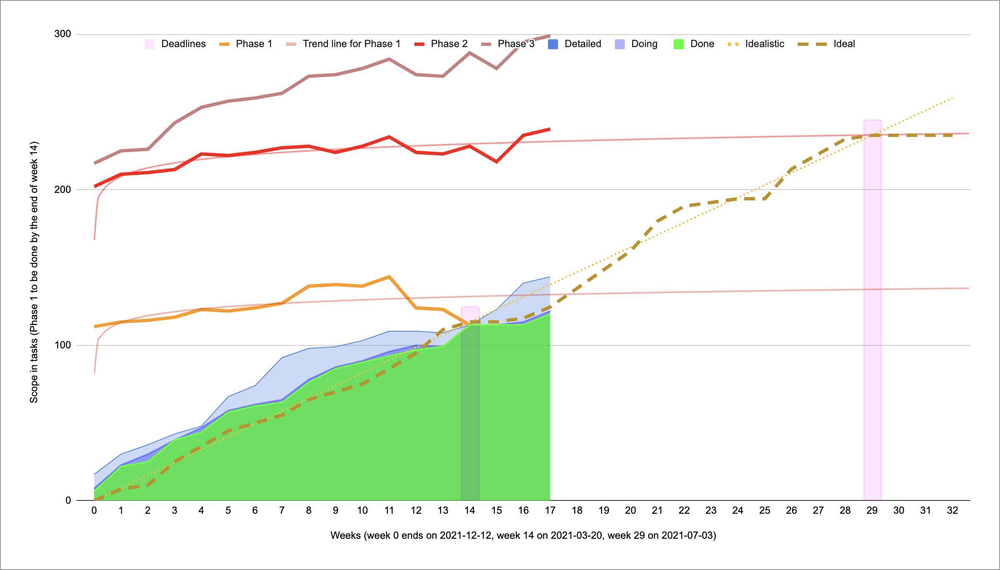

# Progress of the Project

To monitor and control the progress of the project I'm using an approach based on [*#NoEstimates*](https://www.youtube.com/watch?v=QVBlnCTu9Ms) *(if you haven't heard of it, I strongly recommend watching the linked video).*

[More details](#project-details) below the chart. 

## Week 0 - 2021-12-09 -- 2021-12-12

## Project Details
I have started the project on the 2021-12-09 and will have to finish by 2022-07-04. Phase 1 covers the first 14 weeks until the progress report, and Phase 2 covers the rest.
