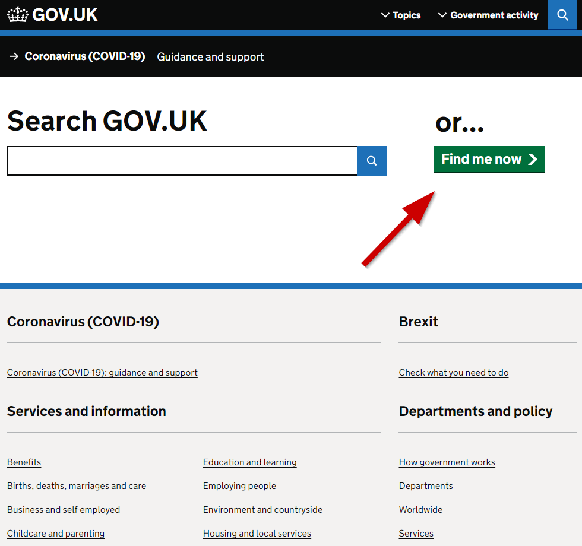
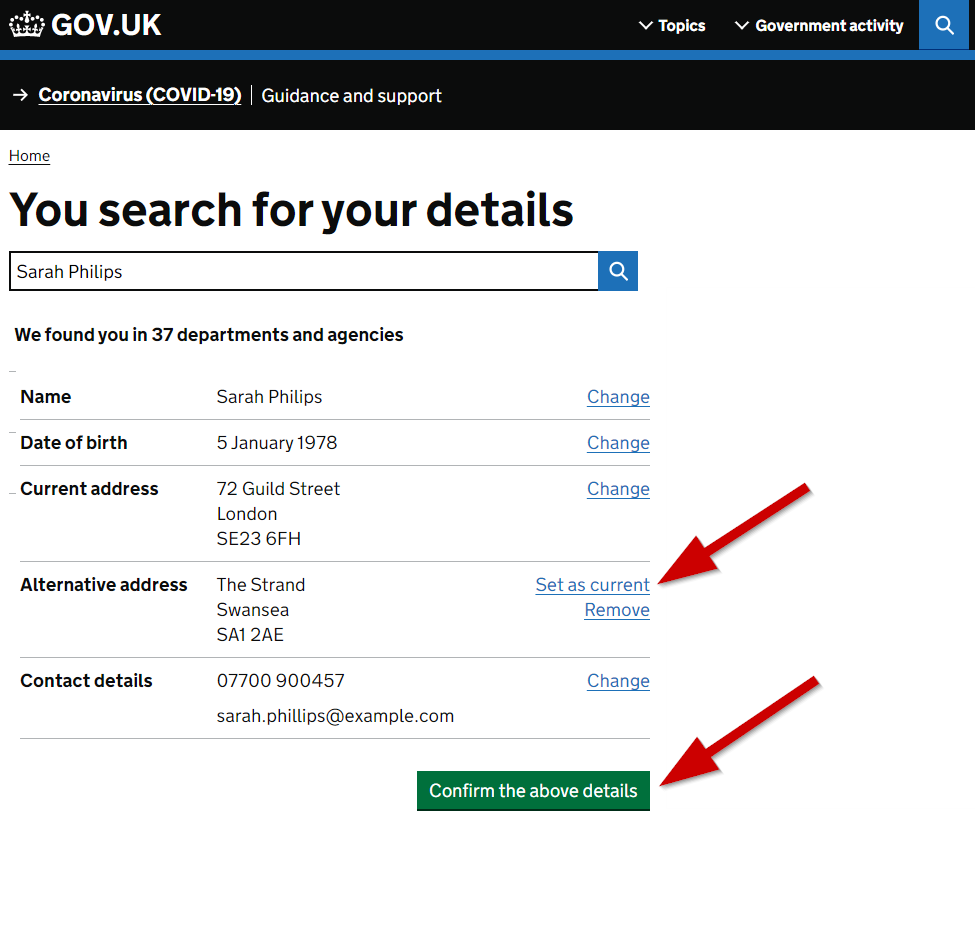

# Find Me (Use Case 1)

Under [UK GDPR](https://ico.org.uk/for-organisations/dp-at-the-end-of-the-transition-period/data-protection-and-the-eu-in-detail/the-uk-gdpr/) and the [Data Protection Act (2018)](https://www.legislation.gov.uk/ukpga/2018/12/contents/enacted) we all have the [Right of Access](https://ico.org.uk/for-organisations/guide-to-data-protection/guide-to-the-general-data-protection-regulation-gdpr/individual-rights/right-of-access/), and the [Right to Rectification](https://ico.org.uk/for-organisations/guide-to-data-protection/guide-to-the-general-data-protection-regulation-gdpr/individual-rights/right-to-rectification/), among the [other individual rights](https://ico.org.uk/for-organisations/guide-to-data-protection/guide-to-the-general-data-protection-regulation-gdpr/individual-rights/). 

[UK Civil Service](https://www.gov.uk/government/organisations/civil-service) consists of [449 department, agencies and public bodies](https://www.gov.uk/government/organisations). They operate largely independently and so to exercise the Rigth of Access we would have to contact all of them independently. 

## The Idea 

How about a search page with a 'find me' button? 

With a single click, all the departments' data would be interrogated and the results presented in an aggregated fashion, something like this: 

Instead of very similar results from all departments, the results could be presented as a single record, perhaps with variations. This covers the Right of Access. 

If we were now able to offer the user a chance to select the current address (out of the known ones) or perhaps update the details and send them back, that would cover the Right to Rectification. 

## The Challenges

This very simple to visualise use case presents significant challenges. But it does show what could be possible if the technology I want to explore with the TopoSearch worked as I hope it will. 

### Data Security
Of course, to do something like this, we would need to have the ability to trust the user's identity. It really must be 'find me' not 'find anybody' button. There is ongoing work on the [UK Digital Identity and Trust Framework](https://www.gov.uk/government/publications/uk-digital-identity-attributes-trust-framework-updated-version).

With a federated search approach, the source information never would have to leave the systems in which it is stored until it is requested by the user, one at a time. This solution could be potentially much safer than any centralised data storage. 

*To be continued...*